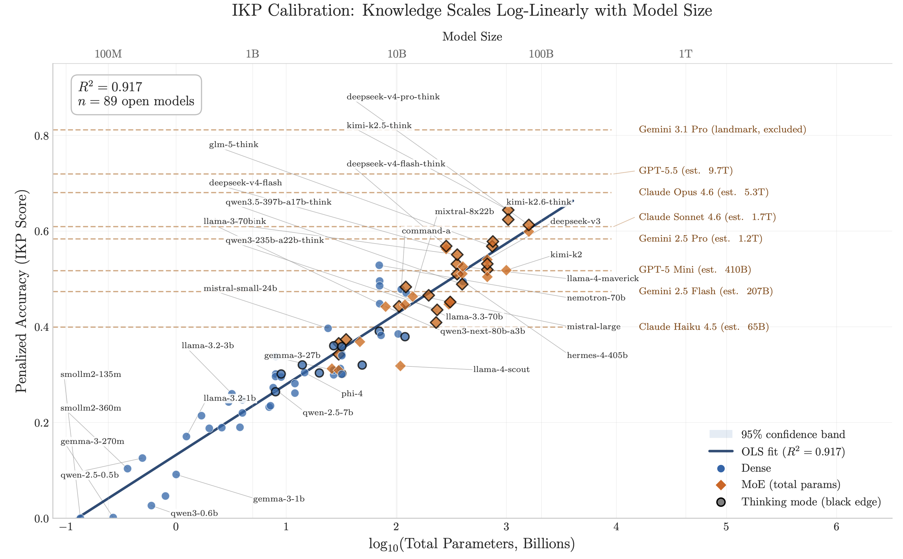

<LinkCard url="https://arxiv.org/pdf/2604.24827" />

- Calibrating what the authors call "Incompressible Knowledge Probes" on open source models with known parameter counts, they found that knowledge scales log-linearly with model size
- Using this trend, they were able to estimate the parameter count of proprietary frontier models
- For instance, at the frontier level, GPT-5.5 is estimated to be 9.7T params, Claude Opus 4.6 is estimated to be 5.3T params, and Gemini 3.1 Pro is excluded as the largest landmark.
- At the sub-frontier level, Sonnet 4.6 is est. 1.7T params while GPT-5 mini is est. 410B params.
- For me, this is a reminder that scaling laws still hold and we are still scaling compute and data as much as we are scaling architectural refinements
